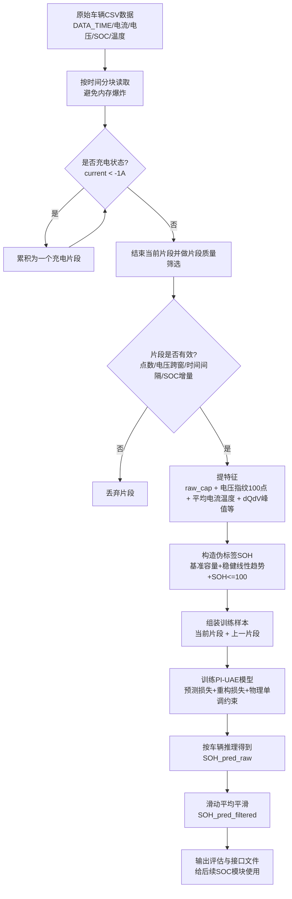

# SOH估计流程图（图示版）+ 参数调参说明 + 电压区间筛选问题分析

> 面向代码初学者：尽量用直白语言解释。

## 一、图示版总流程



---

## 二、每一步到底在干什么（小白版）

1. **读数据**：从 `data/*.csv` 读入关键列。
2. **找“充电片段”**：把连续充电数据切出来（电流阈值法）。
3. **筛垃圾片段**：太短、SOC变化太小、采样断得太厉害、没经过目标电压窗口的片段不要。
4. **算特征**：把每段充电变成一组数字（像体检指标）。
5. **做伪标签SOH**：因为真实SOH难直接测，就先用容量趋势构造近似“真值”。
6. **训练模型**：模型既要会预测SOH，也要会重构电压曲线，还要遵守“SOH不应反常上升”的物理约束。
7. **平滑输出**：把点状预测做平滑，得到更稳定的退化曲线。
8. **导出结果**：输出评估表和 `SOH_Predictions_For_SOC.csv` 给SOC模型对接。

---

## 三、参数逐个怎么调（实战建议）

> 下面按“参数 -> 含义 -> 什么时候调 -> 推荐方向”来讲。

## A. 片段筛选相关

### 1) `V_START=538`, `V_END=558`
- **含义**：只抓这段电压窗口内的曲线当“指纹”。
- **什么时候调**：换车型、串数、或该区间样本太少时。
- **怎么调**：
  - 样本太少 -> 放宽窗口（例如 535~560）。
  - 噪声太大 -> 缩窄到更稳定的恒流段。
- **原则**：优先选“电流相对稳定、覆盖率高”的电压区间。

### 2) `min_seg_points=30`
- **含义**：一个片段至少要有30个点。
- **什么时候调**：采样频率低时可适当降；噪声大时可升。
- **怎么调**：20~60范围试验，观察有效样本数量和RMSE。

### 3) `max_gap_seconds=60`
- **含义**：片段内最大采样间隔不能超过60秒。
- **什么时候调**：数据设备上传不稳定时。
- **怎么调**：
  - 数据断点多 -> 提高到90~180。
  - 要求严格质量 -> 降到30。

### 4) `min_soc_delta=20`
- **含义**：该段充电SOC变化至少20%。
- **什么时候调**：短充电事件太多导致容量估计不稳。
- **怎么调**：
  - 想更稳 -> 提高到25~30。
  - 样本不足 -> 降到10~15（但噪声会增加）。

### 5) `read_chunk_size=200000`
- **含义**：分块读取CSV行数，主要影响内存和速度。
- **怎么调**：内存小就调小（5万~10万），速度慢但更稳。

---

## B. 训练相关

### 6) `batch_size=32`
- **含义**：每次训练喂多少样本。
- **怎么调**：
  - 显存不足 -> 降到16/8。
  - 训练不稳 -> 小batch有时更稳但更慢。

### 7) `epochs=120`
- **含义**：训练轮数。
- **怎么调**：
  - 欠拟合（误差大）-> 增加到150~300。
  - 过拟合（训练好测试差）-> 降低或加强正则。

### 8) `learning_rate=5e-4`
- **含义**：学习率。
- **怎么调**：
  - loss震荡不降 -> 降到1e-4。
  - 降得太慢 -> 升到8e-4或1e-3（谨慎）。

### 9) `lambda_recon=0.5`
- **含义**：重构损失权重（让编码特征更“懂”电压曲线）。
- **怎么调**：
  - 预测一般、重构很好 -> 降低该值。
  - 预测不稳、特征泛化差 -> 适当提高。

### 10) `alpha_physics=0.02`
- **含义**：物理约束权重（惩罚SOH反常上升）。
- **怎么调**：
  - 曲线锯齿、反复上蹿 -> 提高到0.05。
  - 曲线过度僵硬、跟不上真实变化 -> 降到0.005~0.01。

### 11) `smooth_window=15`
- **含义**：预测后滑动平均窗口。
- **怎么调**：
  - 噪声大 -> 增大到21/31。
  - 细节被抹平 -> 降到7/9。

---

## C. 车辆划分/泛化相关

### 12) `split_mode`
- `cross_vehicle`：跨车泛化（更接近真实部署）。
- `intra_vehicle`：同车内训练测试（结果通常更好看，但泛化弱）。

### 13) `train_vehicle_count` / `test_vehicle_count` / `test_vehicle_ratio`
- **用途**：控制训练/测试车数量。
- **建议**：研究泛化时固定测试车，保证可复现对比。

### 14) `fixed_test_vehicles`
- **含义**：固定哪些车做测试。
- **建议**：论文/报告必须固定，避免“每次随机抽车结果不一致”。

### 15) `seed`
- **含义**：随机种子。
- **建议**：固定种子做可复现实验，再换几个种子看稳健性。

---

## D. 工程效率相关

### 16) `use_segment_cache` / `refresh_segment_cache`
- **用途**：缓存片段提取结果，避免反复读原始大CSV。
- **建议**：调参阶段开启缓存；改了片段提取逻辑后强制刷新缓存。

### 17) `reuse_if_same_trainset`
- **用途**：训练集没变时直接复用模型，跳过训练。
- **建议**：快速复现实验时很有用，但要小心“误以为重新训练了”。

---

## 四、你提的关键问题：用电压区间筛选片段会不会不准确？

你的理解非常专业，而且**完全正确**：

电池端电压可以粗略写成：
\[
V_{term} \approx OCV(SOC,T,SOH) + I\cdot R + \eta_{pol}(I, t, T)
\]

所以当电流 \(I\) 快速变化时，端电压会快速变化，不只由SOC决定。

## 1) 为什么会带来偏差

如果只按“端电压是否落在 [V_START, V_END]”筛选：
- 同样SOC下，大电流时端电压更高/更低（取决于充放电符号和模型定义）；
- 同一健康状态下，不同工况会让该区间对应的实际SOC区间漂移；
- 最终导致“你以为在比较同一物理状态”，但实际混入了电流扰动。

这会降低特征一致性，影响SOH估计稳定性。

## 2) 当前代码为什么还能工作

因为它做了几层“缓解”：
- 倾向选恒流较稳定区段（电压窗口策略本意如此）；
- 额外引入平均电流、温度等标量特征补偿；
- 训练时有重构与物理约束，降低纯噪声影响；
- 最后还做了时间平滑。

这些让模型“能用”，但不等于“物理最优”。

## 3) 怎么改得更科学（建议优先级）

### 优先级P0（容易做，收益大）
1. **加电流稳定性筛选**：仅保留 \(|dI/dt|\) 小于阈值的子区段。
2. **加入IR补偿电压**：用 \(V_{corr}=V-I\hat R\) 代替原始V做窗口与指纹。
3. **窗口改成 SOC 窗口 + 电压辅助**：例如 SOC 30%~70% 内再看电压。

### 优先级P1（中等改动）
4. **按 C-rate 分桶建模**：小电流/中电流/大电流分开训练或加条件输入。
5. **引入 OCV-SOC 标定曲线**：把端电压映射到更接近OCV空间。

### 优先级P2（高级）
6. **ECM + 数据驱动混合模型**：先用等效电路分离极化/欧姆压降，再喂给网络。

## 4) 实验上如何验证“你说的这个问题真的存在”

你可以做一个非常直观的小实验：

- 把样本按平均电流分三组（低/中/高）；
- 分别统计同一SOC附近的端电压分布；
- 若三组分布明显错开，说明端电压受电流影响显著；
- 再比较“原始电压特征 vs IR补偿特征”的验证集RMSE。

如果补偿后RMSE稳定下降，就证明你的判断是对的。

---

## 五、给你的调参起步模板（可直接用）

- 第一步（先求稳）：
  - `min_soc_delta=25`
  - `max_gap_seconds=60`
  - `smooth_window=21`
  - `alpha_physics=0.03`
- 第二步（再求准）：
  - 扫描 `V_START/V_END` 3~5组
  - 扫描 `learning_rate` 在 `[1e-4, 3e-4, 5e-4]`
  - 对比 raw/filtered RMSE 与跨车R²
- 第三步（做物理增强）：
  - 加入电流稳定性筛选
  - 尝试IR补偿后再提指纹


---

## 六、本仓库已落地的对应实现（本次更新）

1. 主脚本已支持命令行切换电压窗口：`--v-start` 与 `--v-end`。
2. 主脚本已支持命令行切换学习率：`--learning-rate`。
3. 主脚本已加入“电流稳定性筛选”：`--max-curr-std`（片段内电流标准差超过阈值则丢弃）。
4. 默认固定测试车已调整为两辆：`LFP604EV3` 与 `LFP604EV9`（排除 EV10）。
5. 新增批量实验脚本 `run_window_lr_sweep.py`：可一键运行
   - 窗口 A: 538~558
   - 窗口 B: 540~555
   - 学习率: 1e-4 / 3e-4 / 5e-4
   并输出 `outputs_window_lr_sweep/window_lr_comparison.csv` 做 MAE/RMSE 对比。

### 建议运行命令

```bash
python run_window_lr_sweep.py --epochs 120 --base-output outputs_window_lr_sweep
```
